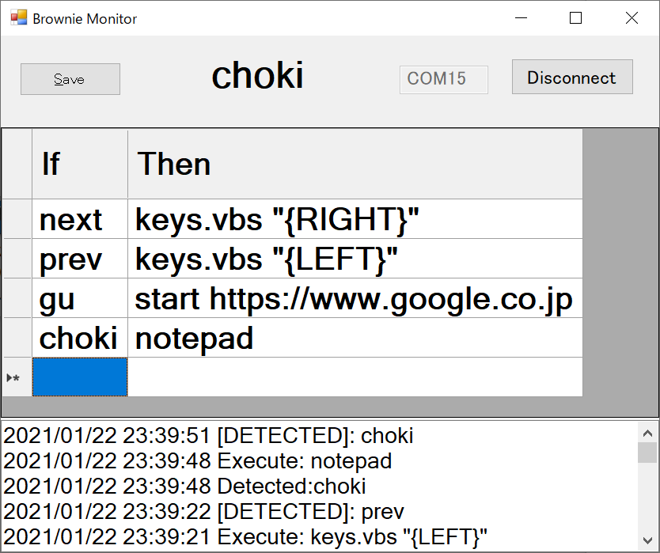

# Brownie Monitor Gui

Brownie で認識した対象に連動して Windows のアプリを操作するためのツールです。
QRコードで登録した英数文字列に相当する物体が検出されたときに、その名前に紐づけられたコマンドを実行します。



## ダウンロード

[BrownieMonitorGui_v1.0.zip](https://github.com/ksasao/brownie/releases/download/v2.2/BrownieMonitorGui_v1.0.zip) (2021/2/23更新)

## 利用方法

- アプリケーションを起動し、M5StickV が接続された COMポートを入力して Connect をクリックすると、Brownie との連携を開始します
- アプリケーションの If の部分に QRコードで指定した文字列を入力します
- Then の部分にその文字列に対応したコマンドを記述します
- If/Then の部分を書き換えた後は、Save をクリックして保存してください

### キーボード操作

Then の部分に ```keys.vbs "{sendkey文字列}"``` を入力すると、キーボードを操作することができます。 例えば、```keys.vbs "{RIGHT}``` と記述すると、右キーが入力されます。これを利用して PowerPoint のページを進めることができます。

```sendkey文字列``` に記述する文字列の詳細は下記を参照してください。

Application.SendKeys メソッド (Excel)
- [https://docs.microsoft.com/ja-jp/office/vba/api/excel.application.sendkeys](https://docs.microsoft.com/ja-jp/office/vba/api/excel.application.sendkeys)

### URLを開く

Then の部分に ```start 任意のURL``` と入力すると、任意のURLを既定のブラウザで開くことができます。

### アプリケーションを起動

Then の部分にパスが通ったアプリケーション名を指定するとそのアプリケーションを実行することができます。パスが通っているかどうかはコマンドプロンプトを開き、

```where notepad```

などと入力して対象のファイルパスがあるかどうかで確認できます。また、Then の部分にフルパスを指定することも可能です。例えば、

```"C:\Program Files\Google\Chrome\Application\chrome.exe"```

など指定して Google Chrome を起動できます。